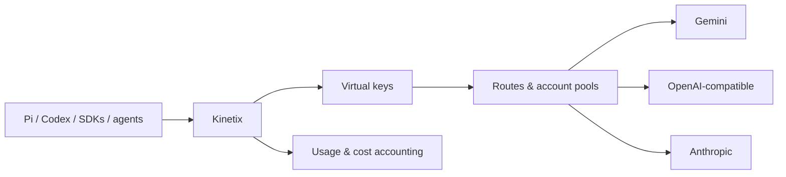

# Kinetix

**Kinetix is a self-hosted LLM gateway for coding agents and small technical teams.** It exposes OpenAI Chat Completions, a documented translated subset of OpenAI Responses, and Anthropic Messages while routing requests across Gemini, OpenAI-compatible, and Anthropic upstreams.

Use virtual keys, account pools, executable Routes, automatic fallback, usage and cost controls, and an embedded admin dashboard — all from a single Rust binary.

[](https://github.com/PrightCord/kinetix/actions/workflows/ci.yml)
[](https://github.com/PrightCord/kinetix/releases/latest)
[](LICENSE)
[](https://github.com/PrightCord/kinetix/wiki)

## Why Kinetix?

LLM clients usually expect one provider and one API shape. Real deployments often need several providers, multiple credentials, fallback, spend controls, and enough observability to understand why a request went where it did.

Kinetix puts those concerns behind one endpoint.

| Capability                    | What Kinetix provides                                                                                |
| ----------------------------- | ---------------------------------------------------------------------------------------------------- |
| **Protocol compatibility**    | OpenAI Chat Completions, translated OpenAI Responses subset, and Anthropic Messages inbound APIs     |
| **Provider portability**      | Gemini, OpenAI-compatible, and Anthropic outbound adapters selected by wire format                   |
| **Virtual keys**              | Per-client model access, RPM/TPM limits, budgets, expiry, IP restrictions, and optional body logging |
| **Account pools**             | Multiple credentials per provider with health state, cooldowns, quotas, and automatic failover       |
| **Executable Routes**         | Priority, round-robin, weighted, and least-used target selection with configurable fallback          |
| **Streaming-safe failover**   | Retry another eligible target before response bytes are committed to the client                      |
| **Extensibility (WASM)**      | Sandboxed WebAssembly (Wasmtime) plugins for custom wire formats, OAuth/credential strategies, routing facts, and probes |
| **Cost accounting**           | Versioned prices, token usage, cached/thinking-aware accounting, exports, and spend views            |
| **Routing diagnostics**       | Route traces, request inspection, and flight-recorder diagnostics                                    |
| **Self-hosted control plane** | SQLite, embedded dashboard, admin API, CLI, backups, and exports                                     |
| **Single binary**             | The proxy and administration CLI ship together                                                       |

Kinetix intentionally ships **no provider presets, bundled price lists, or guessed model capabilities**. Providers, models, prices, and policies remain operator-defined.

## How it works



Clients see a stable OpenAI- or Anthropic-compatible endpoint. Kinetix resolves the requested model or Route, selects an eligible account and upstream target, applies fallback policy when necessary, and records the resulting usage and routing decision.

## Quick start

### 1. Install

The recommended Linux installer resolves the latest release and downloads the matching prebuilt binary for `x86_64` or `aarch64`. If a prebuilt binary cannot be used, it falls back to building from source.

```bash
curl -fsSL https://raw.githubusercontent.com/PrightCord/kinetix/main/install.sh | bash
```

The installer places `kinetix` in `~/.local/bin`, initializes the XDG directories, and prints the generated dashboard admin password **once**.

Kinetix needs no `.env` or configuration file for the normal CLI workflow. State is stored under:

```text
~/.config/kinetix
~/.local/share/kinetix
~/.local/state/kinetix
```

### 2. Add an upstream

Example using Gemini:

```bash
kinetix provider add \
  --name Gemini \
  --base-url https://generativelanguage.googleapis.com/v1beta \
  --wire-format gemini \
  --auth-scheme custom_header \
  --custom-header-name x-goog-api-key \
  --api-key "$GEMINI_API_KEY" \
  --account-label primary
```

### 3. Register a model

```bash
kinetix model add \
  --provider Gemini \
  --upstream-id gemini-2.5-flash \
  --display-name "Gemini 2.5 Flash"
```

### 4. Create a virtual key

```bash
kinetix key create --name local-client --owner me
```

The secret is printed once and starts with:

```text
sk-kinetix-...
```

### 5. Start Kinetix

```bash
kinetix serve
```

The proxy listens on:

```text
http://127.0.0.1:8080
```

The dashboard is available at:

```text
http://127.0.0.1:8080/admin
```

### 6. Make a request

```bash
curl http://127.0.0.1:8080/v1/chat/completions \
  -H "Authorization: Bearer sk-kinetix-..." \
  -H "Content-Type: application/json" \
  -d '{
    "model": "gemini-2.5-flash",
    "messages": [
      {
        "role": "user",
        "content": "Say hello from Kinetix."
      }
    ]
  }'
```

At this point Kinetix is installed, configured, authenticated, and serving inference traffic.

## Client APIs

Kinetix exposes:

```text
POST /v1/chat/completions
POST /v1/responses
POST /v1/messages
GET  /v1/models
GET  /healthz
```

Streaming and non-streaming requests are supported by the inference APIs.

### Pi

Example Pi provider configuration:

```json
{
  "providers": {
    "kinetix": {
      "baseUrl": "http://127.0.0.1:8080/v1",
      "apiKey": "sk-kinetix-...",
      "api": "openai-completions"
    }
  }
}
```

See [docs/pi-compatibility.md](docs/pi-compatibility.md) for Pi-specific compatibility and session-affinity notes.

For protocol behavior and documented deviations, see [docs/compatibility.md](docs/compatibility.md).

## Routing and fallback

A Route is an ordered set of `(account, model)` targets.

Routes can select targets using:

* priority
* round-robin
* weighted
* least-used

Kinetix tracks provider-account state and can react to conditions such as rate limits, quota exhaustion, authentication failures, and configured fallback triggers.

Where fallback is permitted, another eligible target can be selected before the response is committed to the client.

Routes can also use explicit session identity for sticky/cache-aware routing. Kinetix does not guess conversation identity when no supported session identifier is provided.

See the [Routing and Fallback](https://github.com/PrightCord/kinetix/wiki/Routing-and-Fallback) documentation for the full model.

## Virtual keys

Client credentials use the `sk-kinetix-...` format.

Virtual-key secrets are shown once and stored as SHA-256 hashes. Policies can include:

* allowed models, aliases, and Routes
* RPM limits
* TPM limits
* daily USD budgets
* monthly USD budgets
* expiry
* allowed IPs
* optional request/response body logging

This lets different clients, developers, projects, or agents share the same Kinetix deployment without sharing upstream provider credentials.

## Providers and accounts

Providers define an upstream endpoint and wire format. Kinetix currently implements outbound adapters for:

* **Gemini** — `generateContent` / `streamGenerateContent`
* **OpenAI-compatible** — `/chat/completions`
* **Anthropic** — `/messages`

Adapters are selected by configured `wire_format`, not by vendor identity.

Each provider can have multiple credential accounts. Kinetix tracks account health and supports cooldown on `429`, `Retry-After`, quota exhaustion, authentication failures, soft spend quotas, and routing across eligible accounts.

Providers can also bind to WebAssembly plugins for custom wire formats (`wire_plugin`), credential strategies (`credential_plugin`), and model discovery (`model_source_plugin`).

## Plugins and extensibility

When an upstream integration cannot be expressed through standard configuration or built-in wire formats, Kinetix supports sandboxed WebAssembly Component plugins (built on Wasmtime 48):

* **Provider adapters (`wire_plugin`)**: Custom outbound wire translations (such as the bundled `antigravity` adapter for Google's internal API) while Kinetix manages HTTP transport and SSE framing.
* **Credential strategies (`credential_plugin`)**: Dynamic credential acquisition and refresh (such as OAuth 2.0 refresh-token exchanges) with host-managed encrypted leases.
* **Routing facts (`plugin.<id>.<name>`)**: Custom typed facts evaluated by Route predicates during target selection.
* **Health probes**: Core-scheduled background health and quota verification.
* **Model sources (`model_source_plugin`)**: Custom upstream model discovery.

Plugins run with zero ambient authority in a strictly isolated WebAssembly sandbox:

* Packaged as signed or hash-verified `.kxp` archives.
* Declared, all-or-nothing permission grants (host HTTP allowlists, storage).
* Private, encrypted per-plugin KV storage (`plugin_kv`).
* Preemptive epoch interruption and per-store memory limits.
* Automatic circuit breakers that fail closed on repeated faults without impacting native adapters or the core proxy.

## Cost and usage tracking

Kinetix records usage in SQLite through a non-blocking queue.

The accounting model supports:

* versioned per-model prices
* input/output token accounting
* cached-token accounting
* thinking/reasoning-aware billing where available
* daily and monthly budgets
* per-day JSONL and CSV exports
* dashboard spend windows

Pricing remains operator-defined; Kinetix does not ship a vendor price catalog.

## Dashboard

The embedded React dashboard is served at `/admin`.

It covers:

* virtual keys
* providers and models
* provider accounts
* Routes
* model aliases
* usage and spend
* JSONL/CSV exports
* live and completed request inspection
* Route Trace
* flight-recorder diagnostics
* audit log
* admin password management
* Light / Dark / System themes

Destructive actions require confirmation.

> A dashboard screenshot is worth adding here once a stable image is committed to the repository, for example `docs/assets/dashboard.png`.

## Administration

The same `kinetix` binary provides the management CLI.

Examples:

```bash
kinetix status
kinetix doctor

kinetix provider --help
kinetix model --help
kinetix account --help
kinetix route --help
kinetix alias --help
kinetix key --help
kinetix plugin --help
```

Administrative commands operate directly on the SQLite control plane, so most configuration changes work even when the proxy server is stopped and do not require the dashboard or admin password.

The complete command surface is documented in the [CLI Reference](https://github.com/PrightCord/kinetix/wiki/CLI-Reference).

Configuration precedence is:

```text
CLI flag > environment variable > config file > default
```

`--home <dir>` creates an isolated Kinetix instance rooted at that directory.

## Security

Kinetix handles upstream credentials and client authentication keys, so its default deployment model is deliberately conservative.

Highlights include:

* AES-256-GCM encryption for upstream credentials at rest
* WebAssembly Component sandbox (Wasmtime) with all-or-nothing permissions and encrypted KV storage
* hashed virtual-key storage
* SSRF protections for administrator-configured upstream endpoints
* request/response bodies not persisted by default
* separate administrator authentication
* in-memory dashboard sessions
* optional Cloudflare Access integration
* localhost-only deployment defaults
* dependency advisory and license checks in CI

Dashboard sessions are intentionally process-local, so restarting the server invalidates existing sessions.

See [SECURITY.md](SECURITY.md) and the [Security](https://github.com/PrightCord/kinetix/wiki/Security) documentation for the security model and vulnerability-reporting process.

## Deployment

### Native / systemd

See [deploy/README.md](deploy/README.md) for the production runbook covering:

* systemd
* automatic restart
* graceful drain
* Cloudflare Tunnel
* Cloudflare Access
* backup and restore
* upgrades
* health checks

A ready-to-use unit is provided at [deploy/kinetix.service](deploy/kinetix.service).

### Docker

A multi-stage `Dockerfile` and `docker-compose.yml` are included.

```bash
cp .env.docker.example .env
docker compose up -d --build
docker compose logs kinetix | grep -i password
```

All persistent state lives under `/data`.

The Compose configuration binds Kinetix to localhost by default and includes an optional `cloudflared` profile.

## Install versions

Install the latest release:

```bash
curl -fsSL https://raw.githubusercontent.com/PrightCord/kinetix/main/install.sh | bash
```

Pin a release:

```bash
curl -fsSL https://raw.githubusercontent.com/PrightCord/kinetix/main/install.sh \
  | KINETIX_VERSION=v0.1.0 bash
```

Build the current `main` branch instead:

```bash
curl -fsSL https://raw.githubusercontent.com/PrightCord/kinetix/main/install.sh \
  | KINETIX_VERSION=main bash
```

Source builds additionally require Rust/Cargo, Git, Node.js, and npm because the embedded dashboard is built together with the Rust binary.

## Uninstall

```bash
kinetix uninstall
```

Or:

```bash
curl -fsSL https://raw.githubusercontent.com/PrightCord/kinetix/main/uninstall.sh | bash
```

Additional options:

```bash
kinetix uninstall [--yes] [--remove-binary] [--keep-data] [--dry-run]
```

## Documentation

The [Kinetix Wiki](https://github.com/PrightCord/kinetix/wiki) contains task-oriented documentation covering:

* Getting Started
* CLI Reference
* Configuration
* Architecture
* Providers
* Routing and Fallback
* Authentication
* Plugins
* Admin API
* Dashboard
* Observability
* Deployment
* Docker
* Security
* Testing
* Troubleshooting
* FAQ

Wiki sources live in [docs/wiki/](docs/wiki).

Additional technical documentation:

* [docs/DESIGN.md](docs/DESIGN.md) — product and technical design
* [docs/KINETIX-PLUGIN-ARCHITECTURE.md](docs/KINETIX-PLUGIN-ARCHITECTURE.md) — WebAssembly plugin architecture and WIT specification
* [docs/compatibility.md](docs/compatibility.md) — protocol compatibility and documented deviations
* [docs/pi-compatibility.md](docs/pi-compatibility.md) — Pi setup and acceptance notes
* [docs/benchmarks.md](docs/benchmarks.md) — benchmark methodology and results
* [CONTRIBUTING.md](CONTRIBUTING.md) — development and contribution guide
* [SECURITY.md](SECURITY.md) — security policy and vulnerability reporting

## Contributing

Contributions are welcome.

See [CONTRIBUTING.md](CONTRIBUTING.md) for development setup, testing, conventions, and contribution guidance.

For security vulnerabilities, use the private reporting process in [SECURITY.md](SECURITY.md) rather than opening a public issue.

## License

MIT — see [LICENSE](LICENSE).
